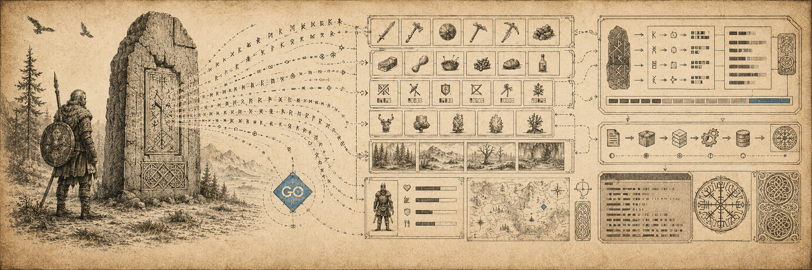

# fch-decoder

Decode current Valheim `.fch` character files from Go, the command line, or a Prometheus scrape target. It reads player identity, stats, inventory, foods, skills, unlocks, known lists, and other saved character data.

## How To Install

### Library

```sh
go get github.com/lanchelms/fch-decoder
```

### CLI

```sh
go install github.com/lanchelms/fch-decoder/cmd/fchdump@latest
go install github.com/lanchelms/fch-decoder/cmd/fchedit@latest
```

Or pull the published container image:

```sh
docker pull ghcr.io/lanchelms/fch-decoder-fchdump:latest
docker pull ghcr.io/lanchelms/fch-decoder-fchedit:latest
```

### Prometheus Exporter

```sh
go install github.com/lanchelms/fch-decoder/cmd/fchprom@latest
```

Or pull the published container image:

```sh
docker pull ghcr.io/lanchelms/fch-decoder-fchprom:latest
```

## Library

Use the Go package when you want structured character data inside your own application.

```go
package main

import (
	"fmt"
	"os"

	fch "github.com/lanchelms/fch-decoder"
)

func main() {
	file, err := os.Open("character.fch")
	if err != nil {
		panic(err)
	}
	defer file.Close()

	character, err := fch.Decode(file)
	if err != nil {
		panic(err)
	}

	fmt.Println(character.Player.Name)
}
```

The decoded trailer includes `hashValid`, which verifies Valheim's current
SHA-512 trailer hash over the inner character payload bytes.

## CLI

### fchdump

`fchdump` decodes one character file and writes formatted JSON to stdout.

```sh
fchdump --character 'testdata/Steam_222222_bortson.fch'
```

You can also set `CHARACTER` and omit `--character`:

```sh
CHARACTER='testdata/Steam_222222_bortson.fch' fchdump
```

Container example:

```sh
docker run --rm -v "$PWD/testdata:/data:ro" \
  ghcr.io/lanchelms/fch-decoder-fchdump:latest \
  --character /data/Steam_222222_bortson.fch
```

### fchedit

`fchedit` decodes one character file, applies requested edits, recalculates
the payload length and trailer hash, and writes the edited file in place by
default. In-place edits create a numbered `.bak` backup next to the original.
Use `--out` to write a copy instead.

```sh
export CHARACTER=character.fch

fchedit set player-stat Deaths 0
fchedit set skill Run 50
fchedit set enemy '$enemy_greydwarf' 25
fchedit set material '$item_wood' 100
fchedit add inventory 'Wood,stack=50,pos=1:2,quality=1'
fchedit remove inventory Stone
```

You can also pass the character file explicitly with `--character`:

```sh
fchedit --character character.fch set skill Run 50
```

To write a copy:

```sh
fchedit --out edited.fch set skill Run 50
```

To preview an edit without writing:

```sh
fchedit --dry-run set skill Run 50
```

To edit in place without creating a backup:

```sh
fchedit --no-backup set skill Run 50
```

To discover editable names:

```sh
fchedit list skills
fchedit list player-stats
fchedit list inventory
```

Inventory additions accept
`name[,stack=n,durability=n,pos=x:y,equipped=bool,quality=n,variant=n,crafter-id=n,crafter-name=s,world-level=n,picked-up=bool]`.
Numeric fields are validated before writing. Skill levels must be between 0 and
100, stat counters must be nonnegative finite numbers, inventory stack and
quality must be at least 1, and item/stat names must not be empty. Inventory
items default to `stack=1`, `durability=100`, `quality=1`, and
`picked-up=true`. If `pos` is omitted, fchedit uses the next empty normal
inventory slot. If `pos` is supplied, both coordinates must be specified as
`x:y`; an occupied target slot is overwritten.

Container example:

```sh
docker run --rm -v "$PWD/testdata:/data" \
  -e CHARACTER=/data/Steam_222222_bortson.fch \
  ghcr.io/lanchelms/fch-decoder-fchedit:latest \
  set skill Run 50
```

## Prometheus Exporter

### fchprom

`fchprom` scans a Valheim `characters_local` directory and serves character metrics at `/metrics`.

```sh
fchprom --dir "$HOME/.config/unity3d/IronGate/Valheim/characters_local" --addr :9108
```

Container example:

```sh
docker run --rm -p 9108:9108 \
  -v "$HOME/.config/unity3d/IronGate/Valheim/characters_local:/characters:ro" \
  ghcr.io/lanchelms/fch-decoder-fchprom:latest --dir /characters --addr :9108
```

For compatibility with the bundled Docker Compose file, `fchprom` also accepts
legacy single-dash long flags such as `-dir /characters` and `-addr :9108`.

Example metric series:

```prometheus
valheim_character_skills{player="Bortson",skill="Run"}
valheim_character_crafting{player="Bortson",recipe="AxeStone"}
valheim_character_enemies{player="Bortson",enemy="Greyling"}
valheim_character_stats{player="Bortson",stat="ArrowsShot"}
valheim_character_distance{player="Bortson",mode="Total"}
valheim_character_scrape_errors
```

The exporter ignores `.fch.old` and `backup_auto-*.fch` files.
