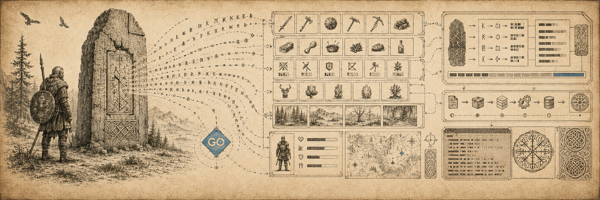

# fch-decoder

[](https://pkg.go.dev/github.com/lanchelms/fch-decoder)
[](https://goreportcard.com/report/github.com/lanchelms/fch-decoder)
[](https://github.com/lanchelms/fch-decoder/blob/main/go.mod)
[](https://github.com/lanchelms/fch-decoder/releases)
[](LICENSE)

Decode, inspect, edit, and export metrics from Valheim `.fch` character files.
Use it as a Go library, one-shot JSON dumper, character editor, or Prometheus
scrape target.

Supports `.fch` character file versions **43** (Valheim Early Access, pre-1.0)
and **46** (Valheim 1.0). Throughout this
documentation, “version 43” and “version 46” refer to the file version
(`Character.Version`, or the top-level `version` in JSON).

The embedded data has separate format versions:

| Character file version | Player data version | Inventory version | Skill version |
| --- | --- | --- | --- |
| 43 | 29 | 106 | 2 |
| 46 | 33 | 109 | 2 |

Encoding preserves source versions; new-character constructors default to file
version 43 and its embedded data versions. Unsupported layouts are rejected.

Version 46 retains ten statistics groups, string biome names, compact inventory
records, and the opaque build-menu blob. Prefab hashes resolve through the bundled
item catalog; unknown or ambiguous hashes remain in `prefabHash` with an empty
`name` and survive unrelated edits. Inventory durability uses integer hundredths;
unedited integer values and optional-field encodings are preserved exactly.
Edited durability is truncated to hundredths as in the game.

## Tools

`fchdump` decodes one `.fch` file to formatted JSON.

`fchedit` validates and edits character data, writing changes in place or to a
copy.

`fchprom` serves Prometheus metrics from a Valheim character directory.

Go programs can import `github.com/lanchelms/fch-decoder` for structured
decode and encode behavior.

## Installation

### Go

Install the library:

```sh
go get github.com/lanchelms/fch-decoder
```

Install the command-line tools:

```sh
go install github.com/lanchelms/fch-decoder/cmd/fchdump@latest
go install github.com/lanchelms/fch-decoder/cmd/fchedit@latest
go install github.com/lanchelms/fch-decoder/cmd/fchprom@latest
```

### Docker

Pull the published images:

```sh
docker pull ghcr.io/lanchelms/fch-decoder-fchdump:latest
docker pull ghcr.io/lanchelms/fch-decoder-fchedit:latest
docker pull ghcr.io/lanchelms/fch-decoder-fchprom:latest
```

Or run them directly:

```sh
docker run --rm -v "$PWD/testdata:/data:ro" \
  ghcr.io/lanchelms/fch-decoder-fchdump:latest \
  --character /data/Steam_222222_bortson.fch
```

```sh
docker run --rm -p 9108:9108 \
  -v "$HOME/.config/unity3d/IronGate/Valheim/characters_local:/characters:ro" \
  ghcr.io/lanchelms/fch-decoder-fchprom:latest \
  --dir /characters --addr :9108
```

The bundled `docker-compose.yml` is for `fchprom`. Configure it with
`FCHPROM_CHARACTERS_DIR` and `FCHPROM_PORT`.

## fchdump

`fchdump` requires `--character` or the `CHARACTER` environment variable and
writes formatted JSON to stdout.

```sh
fchdump --character testdata/Steam_222222_bortson.fch
```

## fchedit

`fchedit` accepts these global flags:

```text
--character STRING   Character file to edit, also read from CHARACTER.
--out STRING         Write to this path instead of updating the input file.
--dry-run            Validate and summarize the edit without writing.
--no-backup          Do not create a backup before editing in place.
```

Commands:

```text
set skill <skill> <level>
set enemy <name> <value>
set material <name> <value>
set player-stat <stat> <value>
add inventory <item>
remove inventory <name>
list skills
list player-stats
list items
list inventory
```

Examples:

```sh
fchedit --character character.fch set skill Run 50
fchedit --character character.fch --dry-run add inventory 'Wood,stack=50,quality=1'
fchedit --character character.fch --out edited.fch set player-stat Deaths 0
```

## fchprom

`fchprom` serves metrics from a Valheim `characters_local` directory.

Shared character metrics:

- `valheim_character_skills{player,skill}`
- `valheim_character_stats{player,group,stat}`
- `valheim_character{player,state}`

The lowercase `group` label is an added label for legacy stats too: update queries
and recording rules that depend on the previous label set. Legacy files retain
the selected counters with `group="RawStats"`. Version 46 exports all 205 saved
scalar values in each populated group, including counters, maxima, and current
state. Groups with all-zero scalars and empty history/activity tables are omitted;
zero-valued scalars within populated groups are retained.
The ten groups are `RawStats`, `Any`, `Hammer`, `Casual`, `VeryEasy`, `Easy`,
`Default`, `Hard`, `VeryHard`, and `Hardcore`. They overlap: choose a group rather
than summing across groups. Edits to overall stats affect only `RawStats` and do
not fabricate achievement progress.

Additional legacy-file metrics:

- `valheim_character_crafting{player,recipe}`
- `valheim_character_enemies{player,enemy}`
- `valheim_character_distance{player,mode}`
- `valheim_character_worlds{player,world}`

Version 46 instead exports these saved activity and history tables as gauges:

- `valheim_character_enemy_kills{player,group,modifier,enemy}`
- `valheim_character_items_crafted{player,group,item}`
- `valheim_character_items_picked_up{player,group,item}`
- `valheim_character_pickables{player,group,pickable}`
- `valheim_character_foods_eaten{player,group,food}`
- `valheim_character_pieces_placed{player,group,piece}`
- `valheim_character_world_time_seconds{player,group,world}`
- `valheim_character_world_key_seconds{player,group,key,setting}`

Enemy modifiers are `MixedAndTotal`, `Unarmed`, `Magic`, `Ranged`, and `Melee`.
Missing activities produce no series. World-key names and settings are trimmed
for export. Bare keys and explicitly empty settings share `setting=""`; elapsed
seconds are summed for entries with the same normalized key and setting within
each group. Original saved strings are preserved by the decoder and encoder.
Times are saved elapsed seconds, not current world settings. Commands and build-menu data are
not exported.

Version 46 movement values appear only in `stats`, without legacy inferred
sailing distance or duplicate compatibility families. Upgraded overall sailing
values may still contain historical sample counts; they are not necessarily
distances in consistent world units.

```text
--dir STRING              Valheim characters_local directory.
--addr STRING             Address to serve Prometheus metrics on. Default: :9108.
--metrics-path STRING     Prometheus metrics path. Default: /metrics.
--workers INT             Maximum files to decode in parallel. Default: 16.
--cache-ttl DURATION      How long to reuse decoded metrics. Default: 5s.
```

Local example:

```sh
fchprom --dir "$HOME/.config/unity3d/IronGate/Valheim/characters_local" --addr :9108
```

Compose example:

```sh
FCHPROM_CHARACTERS_DIR="$HOME/.config/unity3d/IronGate/Valheim/characters_local" \
FCHPROM_PORT=9108 \
docker compose up fchprom
```

## Go Library

Use the Go package when you want structured character data inside your own
application.

```go
package main

import (
	"fmt"
	"os"

	fch "github.com/lanchelms/fch-decoder"
)

func main() {
	file, err := os.Open("character.fch")
	if err != nil {
		panic(err)
	}
	defer file.Close()

	character, err := fch.Decode(file)
	if err != nil {
		panic(err)
	}

	fmt.Println(character.Player.Name)
}
```
